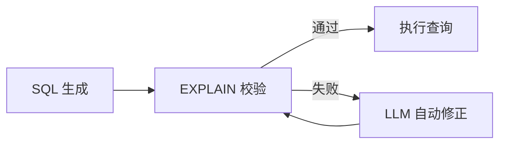

<<<<<<< HEAD
<div align="center">

# Data Agent 🤖📊

**自然语言 → SQL → 数据分析结果 · 端到端智能数据查询 Agent**

[](https://fastapi.tiangolo.com/)
[](https://langchain-ai.github.io/langgraph/)
[](https://vuejs.org/)
[](https://qdrant.tech/)
[](https://www.elastic.co/)
[](data-agent/LICENSE)

---

**让不懂 SQL 的业务人员也能自由查数 —— Data Agent 将日常语言描述的"我想看什么"自动转化为精确的 SQL 查询，从数据仓库中取回结果，全程可视化呈现。**

</div>

---

## 📋 目录

- [为什么需要 Data Agent？](#-为什么需要-data-agent)
- [核心能力](#-核心能力)
- [技术全景](#-技术全景)
- [Agent 工作流深度解析](#-agent-工作流深度解析)
- [快速上手](#-快速上手)
- [项目结构](#-项目结构)
- [API 速览](#-api-速览)
- [配置体系](#-配置体系)
- [开发指南](#-开发指南)
- [应用场景](#-应用场景)

---

## 🎯 为什么需要 Data Agent？

在企业数据分析中，一个长期存在的矛盾是：

> **数据在库里，需求在业务方，SQL 技能在技术团队。**
>
> 一个简单的"帮我看看上个月各品类销售额"，往往要经过「提需求 → 排期 → 写 SQL → 返工沟通 → 出结果」的漫长链路。

**Data Agent 的目标是打破这个壁垒** —— 它不是一个简单的 NL2SQL Demo，而是一套完整的、生产可用的 **智能数据查询中间件**：

| 传统流程 | Data Agent 流程 |
|---------|----------------|
| 业务方提需求给数据分析师 | ✅ 业务方直接输入自然语言 |
| 分析师理解需求并翻译成 SQL | ✅ Agent 自动理解 + 生成 SQL |
| 手动排查表结构、字段含义 | ✅ 自动元数据检索与语义匹配 |
| 写 SQL → 跑不通 → 调试 → 重跑 | ✅ SQL 自动校验 + 自愈修正 |
| 结果通过邮件/截图回传 | ✅ 流式实时推送，前端可视化 |

---

## 💪 核心能力

### 🔄 端到端智能查询链路

```
🗣️ 用户输入 → 🔍 多路召回 → 🧠 LLM 推理 → 📝 SQL 生成
  → ✅ 自动校验 → 🔧 自动修正 → ⚡ 执行查询 → 📊 结果展示
```

整个流程由 **LangGraph 编排的 12 个 Agent 节点** 自动完成，无需人工干预。

### 🔍 多路召回引擎

不是简单地"把问题扔给大模型"——Data Agent 会从三个维度主动获取上下文：

| 召回路 | 存储引擎 | 召回方式 | 解决的问题 |
|--------|---------|---------|-----------|
| **字段召回** | Qdrant 向量库 | 语义相似度搜索 | "销售额"对应 `order_amount` |
| **指标召回** | Qdrant 向量库 | 语义相似度搜索 | "客单价"对应预定义的 AOV 指标 |
| **字段值召回** | Elasticsearch | 全文检索 | "华为手机"对应 `product_name` 中的值 |

这种设计让生成的 SQL **准确率远超"裸调 LLM"**，因为 Agent 在生成 SQL 之前就已经知道了数据库里有什么、字段叫什么、有哪些枚举值。

### 🛡️ SQL 自愈闭环



每个生成的 SQL 都会经过数据库 `EXPLAIN` 验证，语法错误或语义异常会被自动捕获并送入修正循环，直到通过或达到上限。

### ⚡ 实时流式响应

采用 **SSE (Server-Sent Events)** 技术，Agent 的每一个思考步骤都实时推送到前端：

```
抽取关键词 → 召回字段信息 → 合并信息 → 生成 SQL → 校验 → 执行 → 出结果
```

用户看到的不是冰冷的 loading，而是 Agent 一步步"思考"的全过程，体验透明、可预期。

---

## 🏗️ 技术全景

| 层级 | 技术选型 | 选型理由 |
|------|---------|---------|
| **Web 框架** | FastAPI + Uvicorn | 异步高性能，原生 SSE 支持 |
| **Agent 引擎** | LangGraph | DAG 编排复杂 Agent 工作流，状态管理完善 |
| **大语言模型** | 通义千问 (DashScope) | 中文理解能力强，OpenAI 兼容接口灵活切换 |
| **Embedding** | BGE-large-zh-v1.5 | 中文语义向量，1024 维，检索精度高 |
| **向量数据库** | Qdrant | 高性能异步向量检索，支持 Filter 过滤 |
| **全文检索** | Elasticsearch | 成熟的全文索引，支持中文分词 |
| **数据仓库** | MySQL + aiomysql | 异步 ORM，连接池管理，EXPLAIN 校验 |
| **配置管理** | OmegaConf | 类型安全的配置校验，结构化合并 |
| **前端** | Vue 3 + Vite | 轻量响应式 UI，开发体验友好 |

---

## 🔬 Agent 工作流深度解析

Data Agent 的核心是一张由 LangGraph 构建的**有状态工作流图**，每个节点负责一个原子操作：

```
                                ┌─────────────────┐
                                │  用户输入查询     │
                                └────────┬────────┘
                                         ▼
                                ┌─────────────────┐
                          ┌─────│  extract_keywords│ ← jieba 分词 + LLM 扩展
                          │     │   关键词提取     │
                          │     └────────┬────────┘
                          │              │
              ┌───────────┼──────────────┼──────────────┐
              │           │              │              │
              ▼           ▼              ▼              │
    ┌─────────────┐ ┌──────────┐ ┌──────────────┐      │
    │column_recall│ │value_rec │ │metric_recall │      │
    │  Qdrant     │ │all       │ │  Qdrant      │      │
    │  向量召回    │ │ ES 全文  │ │  向量召回     │      │
    └──────┬──────┘ │  检索    │ └──────┬───────┘      │
           │        └────┬─────┘        │              │
           └──────────────┼──────────────┘              │
                          ▼                             │
                ┌──────────────────┐                    │
                │merge_retrieved_  │                    │
                │info              │                    │
                │   合并三路召回    │                    │
                └────────┬─────────┘                    │
                         │                              │
              ┌──────────┴──────────┐                   │
              ▼                     ▼                   │
    ┌───────────────┐     ┌──────────────┐              │
    │filter_table   │     │filter_metric │              │
    │_info          │     │_info         │              │
    │   LLM 过滤表  │     │  LLM 过滤指标 │              │
    └───────┬───────┘     └──────┬───────┘              │
            └───────────┬────────┘                      │
                        ▼                               │
                ┌──────────────┐                        │
                │ add_context  │ ← 注入日期/方言等       │
                └──────┬───────┘                        │
                       ▼                                │
                ┌──────────────┐                        │
                │ generate_sql │ ← LLM 生成 SQL         │
                └──────┬───────┘                        │
                       ▼                                │
                ┌──────────────┐                        │
                │ validate_sql │ ← EXPLAIN 校验         │
                └──────┬───────┘                        │
                       │                                │
               ┌───────┴───────┐                        │
               ▼               ▼                        │
        ┌──────────┐   ┌──────────────┐                 │
        │ execute  │   │ correct_sql  │←─── 回到        │
        │ _sql     │   │  LLM 修正    │    validate      │
        └────┬─────┘   └──────────────┘                 │
             ▼                                          │
       ┌──────────┐                                     │
       │  返回结果  │                                     │
       └──────────┘                                     │
```

### 节点职责详解

| 节点 | 输入 → 输出 | 技术实现 |
|------|-----------|---------|
| `extract_keywords` | 用户查询 → 关键词列表 | jieba 分词（名词/动词/专有名）+ 去停用词 |
| `column_recall` | 关键词 → 相关字段 | Qdrant 向量余弦相似度检索 |
| `value_recall` | 关键词 → 字段枚举值 | ES 全文索引 + 中文分词匹配 |
| `metric_recall` | 关键词 → 业务指标 | Qdrant 向量检索指标定义 |
| `merge_retrieved_info` | 三个召回流 → 结构化信息 | 按表/字段/指标聚合去重 |
| `filter_table_info` | 全量表信息 → 相关表 | LLM 根据查询语义过滤无关表 |
| `filter_metric_info` | 全量指标 → 相关指标 | LLM 根据查询语义过滤无关指标 |
| `add_context` | 基础信息 → 增强上下文 | 注入当前日期、数据库方言/版本 |
| `generate_sql` | 上下文 → SQL 语句 | LLM 严格遵循字段约束生成 SQL |
| `validate_sql` | SQL → 校验结果 | `EXPLAIN` 执行，捕获语法/语义异常 |
| `correct_sql` | SQL + 错误 → 修正后 SQL | LLM 根据错误信息推理修正 |
| `execute_sql` | SQL → 查询结果 | 异步执行，返回结构化数据 |

---

## 🚀 快速上手

### 环境要求

| 组件 | 版本要求 |
|------|---------|
| Python | ≥ 3.11 |
| MySQL | ≥ 8.0 |
| Qdrant | ≥ 1.7 |
| Elasticsearch | ≥ 8.0 |
| Node.js | ≥ 18 |

### 一键启动（Docker 推荐）

```bash
# 克隆项目
git clone https://github.com/your-org/data-agent.git
cd data-agent

# 进入后端
cd data-agent

# 创建虚拟环境并安装依赖
python -m venv .venv && source .venv/bin/activate
pip install -r requirements.txt

# 配置（将实际配置填入）
cp conf/app_config.yaml.example conf/app_config.yaml
vim conf/app_config.yaml   # 填写数据库连接、LLM API Key 等

# 构建元数据知识库（将表结构同步到 Qdrant + ES + MySQL）
python -m app.scripts.build_meta_knowledge -c conf/meta_config.yaml

# 启动 API 服务
uvicorn main:app --host 0.0.0.0 --port 8000 --reload
```

```bash
# 另一个终端 — 启动前端
cd date-agent-frontend
npm install
npm run dev
```

打开浏览器访问 **http://localhost:5173**，即可开始使用。

### 30 秒验证
=======
# Data Agent

一个基于大语言模型的智能数据分析Agent，能够理解自然语言查询，自动生成并执行SQL，从数据库中获取数据并返回分析结果。

## 项目简介

Data Agent 是一款智能数据查询助手，通过自然语言处理技术，让用户无需编写SQL即可完成数据分析工作。用户只需用日常语言描述他们的数据需求，Agent会自动：

1. 理解用户查询意图
2. 从元数据库中检索相关的表、字段和指标信息
3. 生成对应的SQL语句
4. 校验和修正SQL
5. 执行查询并返回结果

## 核心特性

- **自然语言转SQL**：将中文查询转换为精确的SQL语句
- **多数据源支持**：支持MySQL数据仓库、多向量数据库检索
- **智能纠错**：自动校验和修正生成的SQL
- **实时流式输出**：支持SSE流式返回查询进度和结果
- **元数据管理**：自动构建和管理数据仓库的元信息
- **向量检索**：基于Embedding的语义搜索能力

## 技术栈

| 类别 | 技术 |
|------|------|
| Web框架 | FastAPI |
| Agent框架 | LangGraph |
| LLM | 通义千问 (DashScope) |
| Embedding | BGE (BAAI/bge-large-zh-v1.5) |
| 向量数据库 | Qdrant |
| 全文检索 | Elasticsearch |
| 数据库 | MySQL (aiomysql) |
| 异步框架 | asyncio |

## 快速开始

### 环境要求

- Python 3.10+
- MySQL 8.0+
- Qdrant 1.7+
- Elasticsearch 8.0+
- Docker (可选)

### 安装

```bash
# 克隆项目
git clone https://github.com/yourusername/data-agent.git
cd data-agent

# 创建虚拟环境
python -m venv .venv
source .venv/bin/activate  # Linux/Mac
# 或
.venv\Scripts\activate  # Windows

# 安装依赖
pip install -r requirements.txt
```

### 配置

编辑 `conf/app_config.yaml` 配置文件：

```yaml
db_meta:
  host: localhost
  port: 3307
  user: your_user
  password: your_password
  database: meta

db_dw:
  host: localhost
  port: 3307
  user: your_user
  password: your_password
  database: dw

qdrant:
  host: localhost
  port: 6333
  embedding_size: 1024

embedding:
  host: localhost
  port: 8081
  model: BAAI/bge-large-zh-v1.5

es:
  host: localhost
  port: 9200
  index_name: data_agent

llm:
  model_name: qwen-max
  api_key: your_api_key
```

### 启动服务

```bash
# 启动API服务
cd app
uvicorn main:app --host 0.0.0.0 --port 8000 --reload
```

### 构建元数据知识库

在启动服务前，需要先构建元数据知识库：

```bash
python -m app.scripts.build_meta_knowledge -c conf/meta_config.yaml
```

## 使用方法

### API调用
>>>>>>> 4712c8f7e51f56cf0ae81bb8634fffb665c66901

```bash
curl -X POST http://localhost:8000/api/query \
  -H "Content-Type: application/json" \
  -d '{"query": "统计2025年1月份各品类的销售额占比"}'
<<<<<<< HEAD

# 你将看到 SSE 流式输出：
# data: {"stage": "抽取关键词"}
# data: {"stage": "召回字段信息"}
# data: {"stage": "生成SQL", "sql": "SELECT ..."}
# data: {"result": [{"category": "...", "sales": ...}]}
```

---

## 📁 项目结构

```
agent_data/
├── data-agent/                          # 🔵 后端服务（核心）
│   ├── app/
│   │   ├── agent/                       # Agent 智能体核心
│   │   │   ├── nodes/                   #   12 个 LangGraph 节点
│   │   │   ├── graph.py                 #   工作流图定义
│   │   │   ├── llm.py                   #   LLM 客户端（DashScope）
│   │   │   ├── state.py                 #   状态类型定义
│   │   │   └── context.py               #   运行时上下文
│   │   ├── api/routers/                 # API 路由层
│   │   ├── clients/                     # 外部数据源客户端
│   │   │   ├── mysql_client.py          #   MySQL 异步连接池
│   │   │   ├── qdrant_client.py         #   Qdrant 异步客户端
│   │   │   ├── es_client.py             #   Elasticsearch 异步客户端
│   │   │   └── embedding_client.py      #   BGE Embedding 服务
│   │   ├── config/                      # 配置加载（OmegaConf）
│   │   ├── models/                      # 数据模型（MySQL / Qdrant / ES）
│   │   ├── repositories/                # 数据访问层（Repository 模式）
│   │   ├── service/                     # 业务服务
│   │   │   ├── chat_service.py          #   查询对话服务
│   │   │   └── meta_knowledge_service.py #  元数据知识库构建服务
│   │   ├── core/                        # 基础设施
│   │   │   ├── lifespan.py              #   应用生命周期
│   │   │   ├── middleware.py            #   Request ID 中间件
│   │   │   └── logging.py              #   Loguru 结构化日志
│   │   └── scripts/                     # 运维脚本
│   ├── conf/
│   │   ├── app_config.yaml.example      # ⚙️ 应用配置模板
│   │   └── meta_config.yaml             # 📋 元数据表结构定义
│   ├── prompts/                         # 📝 LLM Prompt 模板
│   ├── docker/                          # 🐳 Docker 部署文件
│   ├── main.py                          # 🚀 应用入口
│   └── pyproject.toml                   # Python 依赖声明
│
├── date-agent-frontend/                 # 🟢 前端页面
│   ├── src/
│   │   ├── App.vue                      #   聊天界面（消息/步骤/表格）
│   │   ├── main.js                      #   Vue 入口
│   │   └── style.css                    #   全局样式
│   ├── index.html
│   └── vite.config.js                   #   代理 → localhost:8000
│
├── .gitignore                           # 全局忽略规则
└── README.md                            # 本文档
```

---

## 📡 API 速览

| 端点 | 方法 | 描述 | 响应格式 |
|------|------|------|---------|
| `/api/query` | `POST` | 自然语言查询 | SSE 流式事件 |
| `/health` | `GET` | 服务健康检查 | JSON |
| `/docs` | `GET` | Swagger 交互式文档 | HTML |

> 完整 API 规范、请求/响应示例、多语言 SDK 调用示例 → [API.md](data-agent/API.md)

### SSE 事件类型

| 事件 | 含义 |
|------|------|
| `{"stage": "..."}` | Agent 当前处理步骤 |
| `{"sql": "..."}` | 生成的 SQL |
| `{"result": [...]}` | 最终查询结果 |
| `{"error": "..."}` | 错误信息 |

---

## ⚙️ 配置体系

### `meta_config.yaml` — 数据资产目录

定义数据仓库有哪些表、字段叫什么、业务指标怎么算——这是 Agent 的"领域知识库"：

```yaml
tables:
  - name: fact_order
    role: fact
    description: 订单事实表
    columns:
      - name: order_amount
        role: measure
        description: 订单金额（元）
        alias: [销售额, 营收, 收入]

metrics:
  - name: GMV
    description: 成交总额
    relevant_columns: [fact_order.order_amount]
    alias: [总销售额, 总成交额]
```

### `app_config.yaml` — 运行时配置

数据库连接、Qdrant 地址、ES 地址、LLM 模型与 API Key。**包含敏感信息，已加入 `.gitignore`。**

---

## 🧑‍💻 开发指南

### 扩展 Agent 节点

```python
# 1. 在 app/agent/nodes/ 下创建节点函数
async def my_new_node(state: DataAgentState, runtime: Runtime[DataAgentContext]):
    # 业务逻辑
    return {"field": value}

# 2. 在 app/agent/graph.py 中注册
graph_builder.add_node("my_new_node", my_new_node)
graph_builder.add_edge("previous_node", "my_new_node")
```

### 接入新的数据表

1. 在 `conf/meta_config.yaml` 中定义表结构
2. 运行 `python -m app.scripts.build_meta_knowledge -c conf/meta_config.yaml`
3. Agent 自动识别新表，无需改代码

---

## 🎬 应用场景

| 场景 | 示例查询 | 传统耗时 | Data Agent |
|------|---------|---------|-----------|
| 销售分析 | "上个月各区域销售额排名" | 1-2 小时 | 30 秒 |
| 运营监控 | "近 7 天下单用户数趋势" | 0.5-1 小时 | 20 秒 |
| 财务统计 | "Q4 各品类毛利率" | 2-3 小时 | 30 秒 |
| 商品分析 | "复购率最高的 top10 商品" | 1-2 小时 | 30 秒 |
| 临时取数 | "帮我查一下这个客户的历史订单" | 0.5 小时 | 10 秒 |

---

## 📄 许可证

本项目基于 **MIT License** 开源，详见 [LICENSE](data-agent/LICENSE)。

---

<div align="center">

**用 AI 拉近业务与数据的距离**

[提交 Issue](https://github.com/lei44196/data-agent/issues) · [提交 PR](https://github.com/lei44196/data-agent/pulls) · [项目主页](https://github.com/lei44196/data-agent)

</div>
=======
```

### Python客户端调用

```python
import requests

response = requests.post(
    "http://localhost:8000/api/query",
    json={"query": "统计2025年1月份各品类的销售额占比"},
    stream=True
)

for line in response.iter_lines():
    if line:
        print(line.decode('utf-8'))
```

## 项目结构

```
data-agent/
├── app/
│   ├── agent/                 # Agent核心模块
│   │   ├── nodes/             # LangGraph节点
│   │   │   ├── extract_keywords.py    # 关键词提取
│   │   │   ├── column_recall.py        # 字段召回
│   │   │   ├── value_recall.py        # 值召回
│   │   │   ├── metric_recall.py       # 指标召回
│   │   │   ├── merge_retrieved_info.py # 信息合并
│   │   │   ├── filter_table_info.py   # 表信息过滤
│   │   │   ├── filter_metric_info.py  # 指标信息过滤
│   │   │   ├── add_context.py         # 添加上下文
│   │   │   ├── generate_sql.py        # SQL生成
│   │   │   ├── validate_sql.py        # SQL校验
│   │   │   ├── correct_sql.py         # SQL修正
│   │   │   └── execute_sql.py         # SQL执行
│   │   ├── context.py         # Agent上下文
│   │   ├── graph.py           # LangGraph图定义
│   │   ├── llm.py             # LLM配置
│   │   └── state.py           # Agent状态定义
│   ├── api/                   # API路由
│   │   └── routers/
│   │       └── chat_router.py
│   ├── clients/               # 数据源客户端
│   │   ├── mysql_client.py
│   │   ├── qdrant_client.py
│   │   ├── es_client.py
│   │   └── embedding_client.py
│   ├── config/                # 配置管理
│   │   ├── app_config.py
│   │   └── meta_config.py
│   ├── models/                # 数据模型
│   │   ├── mysql/
│   │   ├── qdrant/
│   │   └── es/
│   ├── repositories/          # 数据访问层
│   │   ├── mysql/
│   │   ├── qdrant/
│   │   └── es/
│   ├── service/               # 业务服务层
│   │   ├── chat_service.py
│   │   └── meta_knowledge_service.py
│   ├── core/                  # 核心模块
│   └── scripts/               # 脚本工具
├── conf/                      # 配置文件
│   ├── app_config.yaml
│   └── meta_config.yaml
└── requirements.txt
```

## Agent工作流程

```
用户查询
    │
    ▼
┌─────────────────┐
│ extract_keywords │  关键词提取
└────────┬────────┘
         │
         ├────────────────────┬────────────────────┐
         ▼                    ▼                    ▼
┌─────────────────┐ ┌─────────────────┐ ┌─────────────────┐
│ column_recall   │ │ value_recall   │ │ metric_recall   │
│ 字段信息召回    │ │ 字段值召回     │ │ 指标召回        │
└────────┬────────┘ └────────┬────────┘ └────────┬────────┘
         │                   │                   │
         └───────────────────┼───────────────────┘
                             ▼
              ┌─────────────────────────┐
              │ merge_retrieved_info    │
              │ 合并召回信息            │
              └────────────┬────────────┘
                         │
         ┌───────────────┴───────────────┐
         ▼                               ▼
┌─────────────────┐             ┌─────────────────┐
│ filter_table_info│             │filter_metric_info│
│ 表信息过滤       │             │ 指标信息过滤    │
└────────┬────────┘             └────────┬────────┘
         └───────────────┬───────────────┘
                         ▼
              ┌─────────────────────────┐
              │ add_context             │
              │ 添加上下文              │
              └────────────┬────────────┘
                         │
                         ▼
              ┌─────────────────────────┐
              │ generate_sql            │
              │ 生成SQL                 │
              └────────────┬────────────┘
                         │
                         ▼
              ┌─────────────────────────┐
              │ validate_sql            │
              │ 校验SQL                 │
              └────────────┬────────────┘
                         │
              ┌──────────┴──────────┐
              ▼                     ▼
         校验通过               校验失败
              │                     │
              ▼                     ▼
      ┌───────────────┐    ┌─────────────────┐
      │ execute_sql  │    │ correct_sql     │
      │ 执行SQL      │    │ 修正SQL        │
      └───────────────┘    └─────────────────┘
```

## 贡献指南

欢迎提交Issue和Pull Request！

1. Fork 本仓库
2. 创建特性分支 (`git checkout -b feature/amazing-feature`)
3. 提交更改 (`git commit -m 'Add amazing feature'`)
4. 推送分支 (`git push origin feature/amazing-feature`)
5. 创建Pull Request

## 许可证

本项目采用 MIT 许可证 - 详见 [LICENSE](LICENSE) 文件

## 联系方式

- 项目主页：https://github.com/lei44196/data-agent
- 问题反馈：https://github.com/lei44196/data-agent/issues
>>>>>>> 4712c8f7e51f56cf0ae81bb8634fffb665c66901
